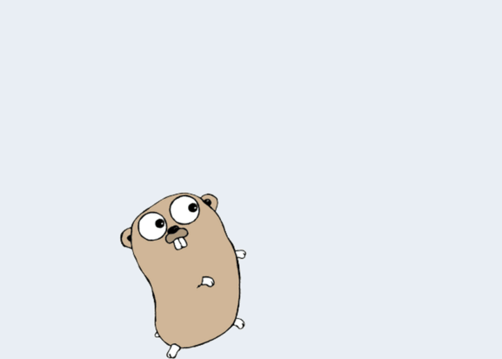
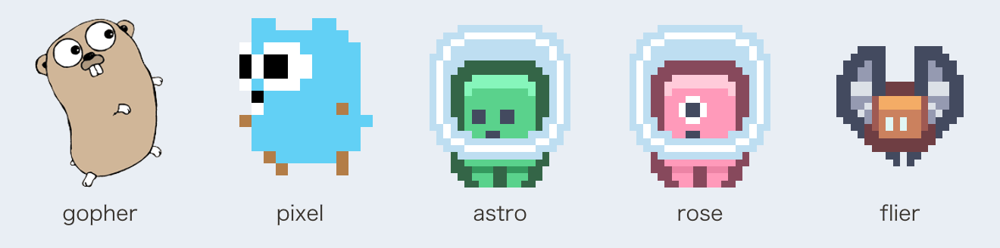

# gumpet

**English** | [日本語](README.ja.md)

<p align="center">
  
</p>

<p align="center">
  <b>A desktop pet that shows you your messages.</b><br>
  Send it some text over HTTP, and a gopher walks over and says it.
</p>

```
gumpetctl "the deploy is done"
```

`gum` is `ugm` rearranged — **u**'ve **g**ot **m**essage, after *You've Got Mail*.
It is a cross-platform take on [mattn/gopher](https://github.com/mattn/gopher),
which does the same thing on Windows only.

- **Anything can talk to it.** A shell script, a CI job, a cron entry, a coding
  agent — if it can make an HTTP request, or run `gumpetctl`, it can tell you
  something.
- **It can ask, too.** Put a question on the pet with buttons and get back the
  one that was pressed. Claude Code and Codex can ask permission this way, so
  you can step away from the terminal.
- **It says how serious it is.** Messages come in info, success, warn and error,
  coloured to match — and the pet jumps for good news and shivers at bad.
- **It has something to say anyway.** Between messages it reads out Hacker
  News headlines — or any feeds you like, or nothing at all.
- **It stays out of the way.** The window is only as big as the pet and its
  balloon. It can fade out or vanish between messages, and click a balloon to
  dismiss it.
- **macOS, Windows and Linux.** Two binaries, and nothing to install
  alongside them.

## Install

Download the archive for your platform from the [releases page][releases] and
put `gumpet` and `gumpetctl` somewhere on your `PATH`. The macOS build is a
universal binary for Apple Silicon and Intel.

### The first run warns you

Nothing is code-signed, so the first time you run a downloaded copy the system
says it cannot vouch for it. That is expected; this is how to get past it, once.

**macOS** says the app cannot be opened because Apple cannot check it for
malicious software. Clear the quarantine flag before running it:

```
xattr -d com.apple.quarantine gumpet gumpetctl
```

Or try to open it once, then press **Open Anyway** under
**System Settings → Privacy & Security**.

**Windows** shows SmartScreen's *Windows protected your PC*. Choose
**More info**, then **Run anyway** — or unblock both files from PowerShell
beforehand:

```
Unblock-File .\gumpet.exe, .\gumpetctl.exe
```

**Linux** has nothing to say about it.

Updates installed from the settings page do not warn again: gumpet downloads
them itself, so they never carry the browser's "came from the internet" mark.
It does check that each one is signed by gumpet's release workflow, and refuses
any that is not — see [Checking a download by hand](docs/guide.md#checking-a-download-by-hand)
to do the same yourself.

### Other ways to install

With Go 1.25 or later:

```
go install github.com/kaakaa/gumpet/cmd/gumpet@latest
go install github.com/kaakaa/gumpet/cmd/gumpetctl@latest
```

While the repository is private, `go install` needs
`GOPRIVATE=github.com/kaakaa/*` and a git credential that can reach it.
Building from a checkout is covered in [DEVELOPMENT.md](DEVELOPMENT.md).

[releases]: https://github.com/kaakaa/gumpet/releases

## Quick start

```
gumpet
```

A gopher appears in the bottom-right corner of your screen and starts walking.
From another terminal:

```
gumpetctl おなかすいた
gumpetctl -title CI -level success "All checks have passed"
go test ./... 2>&1 | tail -1 | gumpetctl -
```

Or skip the client:

```
curl -X POST http://127.0.0.1:8787/api/v1/messages --data-binary 'hello gopher'
```

Click the pet for its menu, or run `gumpetctl -settings` to change how it looks
and behaves in your browser. Changes apply straight away.

## Pick a pet

<p align="center">
  
</p>

Five are bundled — choose one from the pet's menu, the settings page, or
`pet.source` in the config. Or bring your own: an animated GIF, a PNG, or a
folder of frames, with separate frames for talking if you like.
See [Using your own pet](docs/guide.md#using-your-own-pet).

## Let your agent ask you

[contrib/claude-code](contrib/claude-code) has a hook that sends
[Claude Code](https://claude.com/claude-code)'s questions and "finished"
notices to the pet. As a `PermissionRequest` hook, `gumpetctl hook permission`
puts Claude's request to run a command on the pet with **Allow** and **Deny**
buttons, and the button you press is Claude's answer. [Codex](contrib/codex)
uses the same hook format. If nobody answers, the agent falls back to asking in
its terminal.

Your own scripts can ask the same way:

```
gumpetctl ask -choices "Deploy,Wait" "main is green. Deploy?"
```

## Documentation

- **[User guide](docs/guide.md)** — every setting, the HTTP API, how the pet
  moves and when it talks, the menu, your own artwork, fonts, updating
- **[DEVELOPMENT.md](DEVELOPMENT.md)** — building, testing, the
  issue-to-pull-request workflow, and releasing

## License

MIT — see [LICENSE](LICENSE).

### The artwork

Every bundled pet carries a `NOTICE` naming where it came from and under what
terms. Two things are always separate there: the licence on the drawing, and
the licence on the gopher itself, which is Renée French's regardless of who
drew any particular one.

| Pet | Drawing | |
| --- | --- | --- |
| `gopher` | [mattn/gopher](https://github.com/mattn/gopher), MIT | [NOTICE](assets/gopher/NOTICE) |
| `pixel` | [egonelbre/gophers](https://github.com/egonelbre/gophers), CC0 1.0 | [NOTICE](assets/pixel/NOTICE) |
| `astro`, `rose`, `flier` | [Kenney](https://kenney.nl/assets/pixel-platformer), CC0 1.0 | [NOTICE](assets/astro/NOTICE) |

The two gophers are of a character created by Renée French, used under
[CC BY 3.0](https://creativecommons.org/licenses/by/3.0/). CC0 waives rights in
a drawing; it does not waive anything in the character that drawing is of. The
Kenney sprites are nobody's character but their own.

The bundled images have been enlarged by a whole number with nearest-neighbour
sampling, so their pixels stay square, and the multi-tile ones assembled into
animations. They are otherwise unchanged. The images in this README are drawn
from them.
